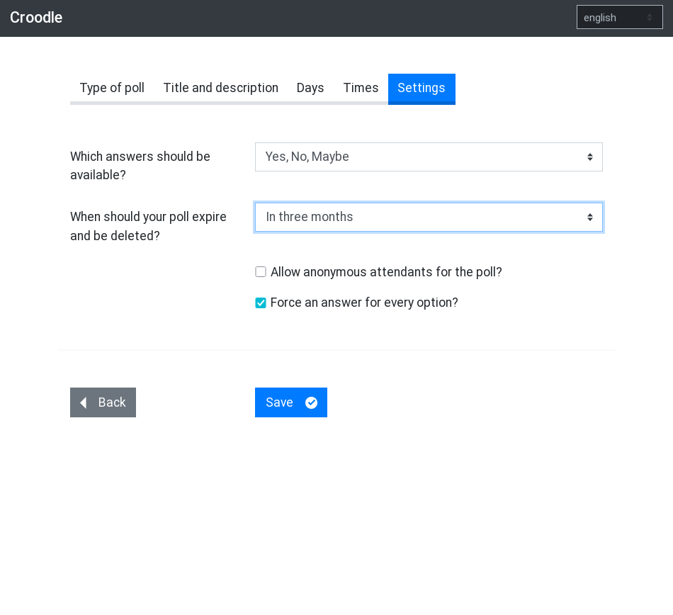

# Croodle

[](https://github.com/jelhan/croodle/actions/workflows/ci.yml?query=branch%3Amaster)
[](https://codeclimate.com/github/jelhan/croodle)

Croodle is an end-to-end encrypted web application to schedule a date or to do a poll on a any topic. All data like title, description, number and labels of options, available answers and names of users and their selections are encrypted/decrypted in the browser using strong 256-bit AES encryption.

[](screenshots/0_type.png)
[](screenshots/1_title_desc.png)
[](screenshots/2_days.png)
[](screenshots/3_times.png)
[](screenshots/4_settings.png)
[](screenshots/5_votes.png)

This is an alpha version. Changes could brake backward compatibility. It is also not well tested and some features are missing. It is not meant for productive use yet.

Croodle is inspired by [PrivateBin](https://github.com/PrivateBin/PrivateBin) and, of course, by Doodle.

## Security notice

As any other web application based end-to-end encryption Croodle could be attacked by an injection of malicious code on serverside or threw a man-in-the-middle attack. If an attacker could inject for example JavaScript, they would be able to read the decrypted content in the browser or the encryption key that is used used and exfiltrate that data.

Therefore you have to:

* use an encrypted connection to the server hosting Croodle. In most use cases this will be an HTTPS connection. We strongly recomend people hosting Croodle to force an encrypted connection.
* trust the server.

Theoretically you could also check for an attack like this by analysing the source code retrieved from server and/or using developer tools of your browser and check what data is send over the network or stored in cookies, local storage or similar browser techniques.

## Requirements

Croodle is designed to have as few as possible requirements on the server it is running on. Croodle runs on almost every web space with PHP >= 7.2. Croodle stores the data in textfiles, so there is no need for a database server like MySQL.

Due to security reasons you should have TLS encryption enabled and provide a valid certificate. (see the [security notice](#security-notice))

## Build process and installation

Production builds are provided as github [release assets](https://github.com/jelhan/croodle/releases).

If you like to build Croodle yourself, you have to install [node](https://nodejs.org/), [pnpm](https://pnpm.io/) and [composer](https://getcomposer.org/) before. It's recommended using [volta](https://volta.sh/) to ensure compatible and tested versions of node and pnpm are used.

```shell
# Clone repository
git clone git@github.com:jelhan/croodle.git && cd croodle

# Install dependencies
pnpm install

# Build croodle
pnpm run build
```

Afterwards copy all files in `/dist` folder to your werbserver.

### Configuration

The API can be configured by creating a `config.php` inside `api/` folder which returns an associative array.
Have a look at `api/config.default.php` for available options.

### Webserver configuration

* `data/` folder has to be writeable by web server, but **must not** be accessible publicly. Protect it in your webserver configuration or move it out of webroot by changing `dataDir` api option.
* Croodle uses [subresource integrity](https://developer.mozilla.org/en-US/docs/Web/Security/Subresource_Integrity) (SRI) for assets. Therefore you **must not** tamper with build output (e.g. you have to disable cloudflare [*Auto Minify*](https://support.cloudflare.com/hc/en-us/articles/200167996-Does-CloudFlare-have-HTML-JavaScript-and-CSS-compression-features-) feature). If that's not an option for you, you have to [disable SRI](https://github.com/jonathanKingston/ember-cli-sri#options) and build yourself.
* HTTPS connection should be forced. You should consider using [HTTP Strict Transport Security](https://developer.mozilla.org/en-US/docs/Web/Security/HTTP_strict_transport_security) (HSTS) and [HTTP Public Key Pinning](https://developer.mozilla.org/en-US/docs/Web/Security/Public_Key_Pinning) (HPKP).
* [Content-Security-Policy](http://content-security-policy.com/) (CSP) and [Referrer-Policy](https://w3c.github.io/webappsec-referrer-policy/) headers should be used. Default headers are provided in `.htaccess` file but commented out.
* Execute `php api/cron.php` on a regular basis to delete outdated polls. A cronjob running once a day should be fine.

## Development

`pnpm dev` generates a development build of Croodle and starts
a server serving the client on `http://localhost:4200` and another one
serving the API on `http://localhost:8000`.
If source files are changing, a rebuild and reload is triggered.

By default Croodle uses an api mock in development. Since that one
does not persist records all polls are gone after a reload.

If you like to test a production build, build Croodle with `pnpm build`
and start a server previwing the build with `pnpm preview`.

## Running tests

Tests for both Client and API can be run with `pnpm test`.

### Client

You can run the tests for the client on the command line with `pnpm test:client`.
Alternatively you can run Croodle with `pnpm start` and open the tests at `http://localhost:4200/tests`.

Tests are run against a mock-api provided by [MirageJS](https://miragejs.com/).
Therefore they don't cover system integration.

### API

API tests are provided by Codeception. You can run them with `pnpm test:api`. You have
to install composer development requirements before (`composer install`
without `--no-dev` option).

## License

Croodle is [MIT Licensed](https://github.com/jelhan/croodle/blob/master/LICENSE).
